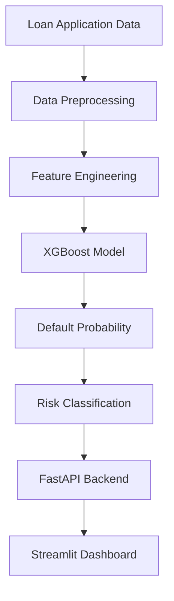

## 
<div align="center">

# 🏦 Loan Default Risk Prediction

### End-to-end ML system to predict credit default probability — from raw data to a deployed REST API


[**Live Demo →**](https://loan-default-prediction-fyiihfwhxuv62f2lu8k2gu.streamlit.app/) &nbsp;|&nbsp; [**API Docs →**](https://loan-default-prediction-production.up.railway.app/docs) &nbsp;|&nbsp; [**Notebook →**](notebooks/loan_default_prediction.ipynb)

</div>

---
## 🎥 Demo Video
https://github.com/user-attachments/assets/913afd39-e6c1-4f47-ab41-d5670f5a95b3
##

## Overview

Financial institutions lose billions annually to loan defaults. This project builds an **end-to-end credit risk scoring system** that estimates the probability a borrower will default, using gradient boosted trees trained on 32,000+ real loan records.

The system goes beyond a Jupyter notebook — it ships a **FastAPI backend** deployed on Railway and a **Streamlit frontend** on Streamlit Cloud, accepting live applicant data and returning a risk score in real time.

**Dataset:** [Credit Risk Dataset – Kaggle](https://www.kaggle.com/datasets/laotse/credit-risk-dataset) &nbsp;|&nbsp; 32,581 records · 12 features · 21.8% default rate

---

##  Results

| Model | Precision | Recall | F1 Score | ROC-AUC |
|---|---|---|---|---|
| Logistic Regression | 0.73 | 0.56 | 0.64 | 0.867 |
| Random Forest | 0.91 | 0.72 | 0.82 | 0.933 |
| **XGBoost**  | **0.93** | **0.72** | **0.83** | **0.942** |

 XGBoost selected as final model. Optimised for **recall** — in credit risk, a missed default (false negative) is costlier than a false alarm.

---

## System Architecture

```
┌─────────────────────────────────────────────────────────┐
│                     Streamlit Cloud                      │
│   User fills applicant form → POST /predict              │
└──────────────────────┬──────────────────────────────────┘
                       │  JSON payload (12 features)
                       ▼
┌─────────────────────────────────────────────────────────┐
│                  FastAPI  (Railway)                       │
│                                                          │
│   Raw Input → ColumnTransformer → XGBoost.predict_proba  │
│                                                          │
│   Returns: { risk_category, default_probability }        │
└─────────────────────────────────────────────────────────┘
```

---

##  ML Pipeline

### 1. Data Cleaning
- Removed logical impossibilities: rows where `person_emp_length > person_age`
- Dropped rows with simultaneous nulls in `loan_int_rate` and `person_emp_length`
- Removed outlier: single row with `loan_int_rate > 20` + missing employment (data error)

### 2. Feature Engineering
| Feature | Type | Description |
|---|---|---|
| `person_emp_length_missing` | Binary flag | Missing employment length is itself predictive — borrowers with unknown employment default at higher rates |
| `loan_percent_income` | Ratio | `loan_amnt / person_income` — debt-to-income proxy |

### 3. Imputation Strategy
- `person_emp_length` nulls → filled with **median**
- `loan_int_rate` nulls → filled with **within-grade median** (preserves grade-level interest rate signal)

### 4. Preprocessing
- `OneHotEncoding` on 4 categorical columns: `person_home_ownership`, `loan_intent`, `loan_grade`, `cb_person_default_on_file`
- `StandardScaler` applied only to Logistic Regression (tree models are scale-invariant)
- Preprocessing saved as `preprocessor.pkl` via `ColumnTransformer` for consistent inference

### 5. Key EDA Findings
-  **Loan grade** is the strongest default predictor — Grade G default rate ~4× Grade A
-  **Loan-to-income ratio** separates defaulters cleanly (defaulters avg 0.38 vs 0.16)
-  **RENT** ownership defaults more than MORTGAGE or OWN
-  **Debt consolidation** and **medical** loan intents have highest default rates
-   Missing `emp_length` → higher default rate (informative missingness)

### 6. SHAP Explainability
Top features by SHAP importance:
1. `loan_int_rate` — higher rate = higher risk (also a proxy for perceived risk)
2. `loan_percent_income` — debt burden relative to income
3. `loan_grade` — lender's internal risk rating
4. `person_home_ownership` — financial stability signal
5. `person_emp_length_missing` — informative missingness flag

##  Project Workflow



---

## Project Structure

```
loan-default-prediction/
├── notebooks/
│   └── loan_default_prediction.ipynb   # EDA, feature engineering, training, SHAP
├── models/
│   ├── xgboost_model.pkl               # Trained XGBoost classifier
│   └── preprocessor.pkl                # Fitted ColumnTransformer
├── Fast_api_app.py                     # FastAPI prediction endpoint
├── streamlit_app.py                    # Streamlit frontend
└── requirements.txt
```

---

## Project Features

- XGBoost Machine Learning Model
- Feature Engineering Pipeline
- SHAP Explainable AI
- FastAPI Backend
- Streamlit Frontend
- Probability-Based Risk Assessment
- Real-Time Predictions
- Railway Deployment
- Production-Ready Inference Pipeline


---

##  API Reference

**`POST /predict`** — Returns default probability for a loan applicant

**Sample Request:**
```json
{
  "person_age": 28,
  "person_income": 60000,
  "person_home_ownership": "RENT",
  "person_emp_length": 3.0,
  "loan_intent": "PERSONAL",
  "loan_grade": "B",
  "loan_amnt": 10000,
  "loan_int_rate": 12.5,
  "loan_percent_income": 0.17,
  "cb_person_default_on_file": "N",
  "cb_person_cred_hist_length": 4.0,
  "person_emp_length_missing": 0
}
```

**Sample Response:**
```json
{
  "risk_category": "Low Risk",
  "default_probability": 0.1342
}
```

**`GET /`** — Health check

---

##  Tech Stack

| Layer | Tool | Purpose |
|---|---|---|
| ML Model | XGBoost 3.2 | Gradient boosted classifier |
| Preprocessing | scikit-learn ColumnTransformer | OHE + scaling pipeline |
| Explainability | SHAP TreeExplainer | Feature importance + waterfall plots |
| API | FastAPI + Uvicorn | REST inference endpoint |
| Frontend | Streamlit | Interactive prediction UI |
| API Deployment | Railway | Cloud hosting for FastAPI |
| UI Deployment | Streamlit Cloud | Cloud hosting for frontend |
| Serialization | joblib | Model + preprocessor persistence |

---


##  Author

**Vipul Singh**  

[LinkedIn](https://www.linkedin.com/in/vipul-singh-243700282/) 

