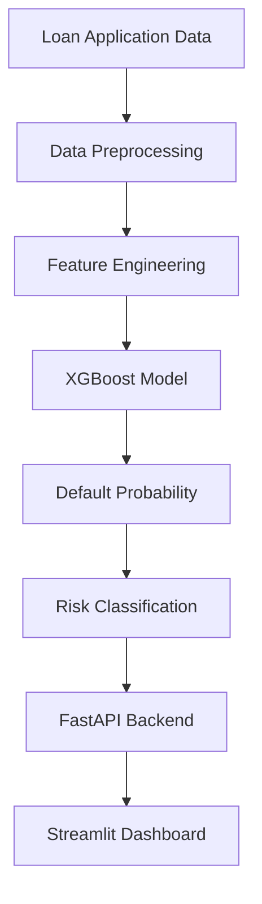

#  Loan Default Risk Prediction

An end-to-end Machine Learning system that predicts the probability of loan default using applicant financial, employment, and credit history information. The project combines data preprocessing, feature engineering, explainable AI, model deployment, and a production-ready API.
## Streamlit Link
https://loan-default-prediction-nj6852wyvya53dzzeztef8.streamlit.app/
##
## 🌐 Live Demo

### FastAPI API

https://your-railway-link.up.railway.app/docs

---

## Project Features

-Loan Default Prediction
- XGBoost Machine Learning Model
- Feature Engineering Pipeline
- SHAP Explainable AI
- FastAPI Backend
- Streamlit Frontend
- Probability-Based Risk Assessment
- Real-Time Predictions
- Railway Deployment
- Production-Ready Inference Pipeline

---

## Tech Stack Used

-Python
- Pandas
- NumPy
- Scikit-Learn
- XGBoost
- SHAP
- FastAPI
- Streamlit
- Joblib
- Uvicorn
- Railway

---

## Model Performance

| Metric  | Score   |
| ------- | ------- |
| ROC-AUC | 0.94    |
| Model   | XGBoost |

---

##  Key Risk Factors Identified

-Loan Interest Rate
-Loan-to-Income Ratio
-Annual Income
-Loan Amount
-Credit History Length

SHAP analysis was used to explain model predictions and identify the most influential features.

---

##  Project Workflow



---

## 📂 Project Structure

```text
Loan-Default-Prediction/
│
├── Dataset/
├── notebooks/
├── models/
│   ├── xgboost_model.pkl
│   └── preprocessor.pkl
│
├── Fast_api_app.py
├── streamlit_app.py
├── requirements.txt
└── README.md
```

---

## Explainable AI

The project uses SHAP (SHapley Additive exPlanations) to interpret model predictions and understand how individual features contribute to loan default risk.

---

##  Author

Vipul Singh

LinkedIn:
https://www.linkedin.com/in/vipul-singh-243700282/


